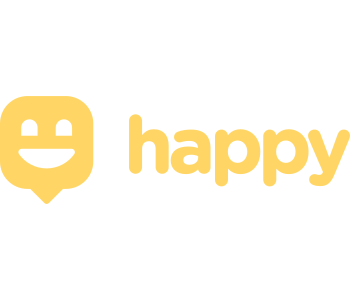

<h1 align="center">Happy - Projeto Multiplataforma</h1>

  

  Use o Happy para trazer alegria as crianças em lares de adoção. Esse projeto visa conectar pessoas que desejam fazer visitas a esses locais para distribuição de brinquedos ou ações solidárias em cada região do país. <strong>Acesse as pastas de cada módulo para mais informações.</strong>

  

    <a aria-label="Matheus" href="https://github.com/matheusmaximianomv">
      </img>
    </a>
    <a aria-label="NodeJs" href="https://nodejs.org/en/">
      </img>
    </a>
    <a aria-label="ReactJs" href="https://pt-br.reactjs.org/">
      </img>
    </a>
    <a aria-label="Native" href="https://reactnative.dev/">
      </img>
    </a>
  

## Apresentação

Aplicação desenvolvida na 3ª Next Level Week da Rocketseat. Todo o projeto foi feito com a Stack Node.js, ReactJs e React Native, todas elas com o offset typescript. Além das tecnologias apresentadas durantes as aulas foram utilizadas outras para auxiliar no desenvolvimento e fixar conteúdos relativos.  

## Tecnologias
* NodeJs&nbsp;&nbsp;&nbsp;&nbsp;
* ReactJs&nbsp;&nbsp;&nbsp;
* React Native&nbsp;&nbsp;&nbsp;
  
## Executando o Projeto
Para executar o projeto você precisa seguir os passos de acordo com o tipo, backend, frontend ou mobile. Outras instrunções estarão no README.md dos respectivos módulos.:
1. Clone o projeto: `git clone https://github.com/matheusmaximianomv/happy`
2. Entre na pasta: `cd happy/{backend || web || mobile}`
3. Instale as dependências:
 Usando NPM `npm install`
 Usando o Yarn `yarn`, caso tenha instalado.
4. Execute o projeto de acordo com os comandos necessários.

## Contribua

1. Fork it (https://github.com/matheusmaximiano/happy/fork)
2. Crie uma branch de feature (git checkout -b feature/algumacoisa)
3. Commit suas alterações (git commit -m 'Tipo: Modificação')
4. Dê o push para a nova branch (git push origin feature/algumacoisa)
5. Crie uma nova Pull Request
