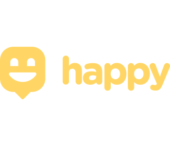

<h1 align="center">Happy - Mobile</h1>

  
  
  

  Use o Happy para trazer alegria as crianças em lares de adoção. Esse projeto visa conectar pessoas que desejam fazer visitas a esses locais para distribuição de brinquedos ou ações solidárias em cada região do país.

  

    <a aria-label="Matheus" href="https://github.com/matheusmaximianomv">
      </img>
    </a>
    <a aria-label="Native" href="https://reactnative.dev/">
      </img>
    </a>
    <a aria-label="expo" href="https://expo.io/">
      </img>
    </a>
  

## Apresentação

Aplicação desenvolvida na 3ª Next Level Week. O app foi desenvolvido com o Expo como apresentado nas aulas. Além das tecnologias apresentadas durantes as aulas foram utilizadas outras para auxiliar no desenvolvimento e fixar conteúdos relativos. <strong>OBS: Os gifs podem demorar um pouco a começar, caso não apareçam reinicia a página</strong>  

<h4 align="center">Aplicativo em Execução</h4>

  

## Tecnologias
* React Native&nbsp;&nbsp;&nbsp;&nbsp;
* React Navigation&nbsp;&nbsp;&nbsp;
* React Native Maps&nbsp;&nbsp;&nbsp;
* Axios&nbsp;&nbsp;&nbsp;
* Expo&nbsp;&nbsp;&nbsp;
* Expo Vector Icons&nbsp;&nbsp;&nbsp;
* Expo Image Pìcker&nbsp;&nbsp;&nbsp;
* Typescript&nbsp;&nbsp;&nbsp;
* Google-Fonts&nbsp;&nbsp;&nbsp;
* Styled-Components&nbsp;&nbsp;&nbsp;
* ESlint&nbsp;&nbsp;&nbsp;
* Prettier&nbsp;&nbsp;&nbsp;

## Executando o Projeto
Após realizar as devidas configurações de ambiente em seu computador ou no seu dispositivo móvel, para projetos react-native e expo, abra o terminal e execute os seguintes comandos:
1. Clone o projeto: `git clone https://github.com/matheusmaximianomv/happy`
2. Entre na pasta: `cd happy/mobile`
3. Instale as dependências:
 Usando NPM `npm install`
 Usando o Yarn `yarn`
4. Execute o projeto:
 Usando NPM `npm run dev`
 Usando o Yarn `yarn start`
5. Execute o projeto no seu dispositivo instalando o app do Expo e lendo por ele o QR Code gerado no terminal após a execução do comando anterior.

## Contribua

1. Fork it (https://github.com/matheusmaximiano/happy/fork)
2. Crie uma branch de feature (git checkout -b feature/algumacoisa)
3. Commit suas alterações (git commit -m 'Tipo: Modificação')
4. Dê o push para a nova branch (git push origin feature/algumacoisa)
5. Crie uma nova Pull Request
