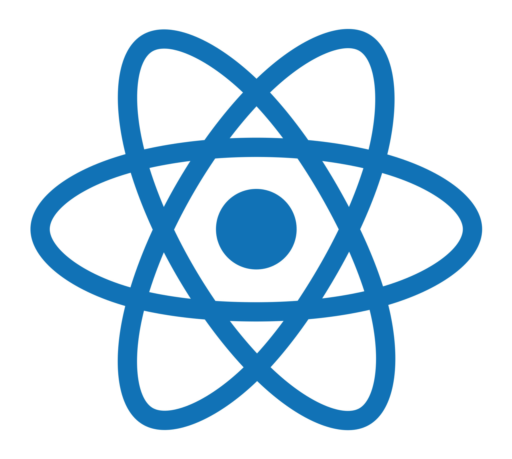

<h1 align="center">Happy - WEB</h1>

  
  
  

  Use o Happy para trazer alegria as crianças em lares de adoção. Esse projeto visa conectar pessoas que desejam fazer visitas a esses locais para distribuição de brinquedos ou ações solidárias em cada região do país.

  

    <a aria-label="Matheus" href="https://github.com/matheusmaximianomv">
      </img>
    </a>
    <a aria-label="ReactJs" href="https://pt-br.reactjs.org/">
      </img>
    </a>
    <a aria-label="Express" href="https://www.typescriptlang.org/" >
      </img>
    </a>
  

## Apresentação

Aplicação desenvolvida na 3ª Next Level Week da Rocketseat. O framework javascript utilizado foi o ReactJs com Typescript. Além das tecnologias apresentadas durantes as aulas foram utilizadas outras para auxiliar no desenvolvimento e fixar conteúdos relativos. <strong>OBS: Os gifs podem demorar um pouco a começar.</strong>  

<h4 align="center">Execução</h4>

  

## Tecnologias
* ReactJs&nbsp;&nbsp;&nbsp;&nbsp;
* Typescript&nbsp;&nbsp;&nbsp;&nbsp;
* create-react-app&nbsp;&nbsp;&nbsp;
* React-router-dom&nbsp;&nbsp;&nbsp;
* React-Icons&nbsp;&nbsp;&nbsp;
* Axios&nbsp;&nbsp;&nbsp;
* React-leaflet&nbsp;&nbsp;&nbsp;
* Leaflet&nbsp;&nbsp;&nbsp;
* Styled-Components&nbsp;&nbsp;&nbsp;
* ESlint&nbsp;&nbsp;&nbsp;
* Prettier&nbsp;&nbsp;&nbsp;

## Executando o Projeto
Para executar o projeto você precisa ter instalado o NPM ou o Yarn em sua máquina, em seguida, abra o terminal e execute os seguintes comandos:
1. Clone o projeto: `git clone https://github.com/matheusmaximianomv/happy`
2. Entre na pasta: `cd happy/web`
3. Instale as dependências:
 Usando NPM `npm install`
 Usando o Yarn `yarn`, caso tenha instalado.
4. Execute o projeto:
 Usando NPM `npm run start`
 Usando o Yarn `yarn start`, caso tenha instalado.
5. O App estará executando em http://localhost:3000

## Contribua

1. Fork it (https://github.com/matheusmaximiano/happy/fork)
2. Crie uma branch de feature (git checkout -b feature/algumacoisa)
3. Commit suas alterações (git commit -m 'Tipo: Modificação')
4. Dê o push para a nova branch (git push origin feature/algumacoisa)
5. Crie uma nova Pull Request
